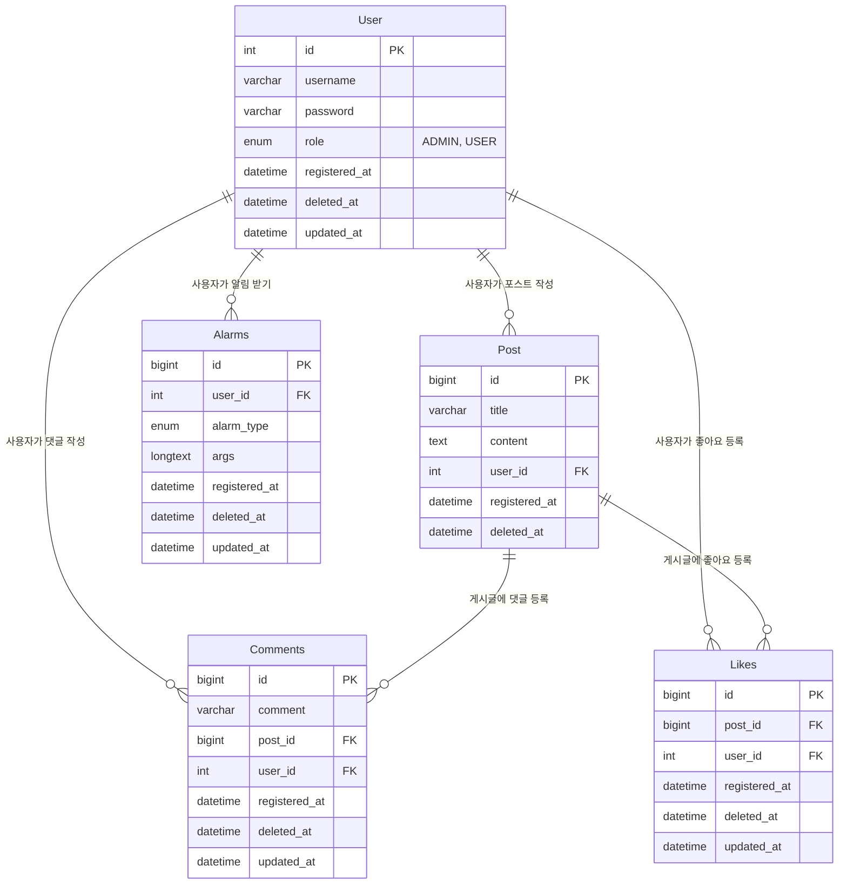

# 📌 Post API Project

Spring Boot와 MariaDB를 활용한 기본적인 게시글 관리 REST API 서버입니다.

## 🛠 기술 스택

* **Framework:** Spring Boot 3.4.4
* **Language:** Java 17
* **Database:** MariaDB
* **ORM:** Spring Data JPA
* **Build Tool:** Gradle

---

## 🗄 ERD



---

## 🚀 API 명세

* **post-controller**

| Endpoint | Method | Description |
| --- | --- | --- |
| `/api/v1/posts` | `POST` | 새 게시글 등록 |
| `/api/v1/posts` | `GET` | 전체 게시글 목록 조회 |
| `/api/v1/posts/my` | `GET` | 회원 게시글 목록 조회 |
| `/api/v1/posts/{id}` | `GET` | 특정 게시글 상세 조회 |
| `/api/v1/posts/{id}` | `PUT` | 게시글 내용 수정 |
| `/api/v1/posts/{id}` | `DELETE` | 게시글 삭제 |
| `/api/v1/posts/{id}/likes` | `GET` | 좋아요 개수 조회 |
| `/api/v1/posts/{id}/likes` | `POST` | 좋아요 등록 |
| `/api/v1/posts/{id}/comments` | `GET` | 댓글 목록 조회 |
| `/api/v1/posts/{id}/comments` | `POST` | 댓글 등록 |

* **user-controller**

| Endpoint | Method | Description |
| --- | --- | --- |
| `/api/v1/users/login` | `POST` | 로그인 |
| `/api/v1/users/join` | `POST` | 회원가입 |
| `/api/v1/users/alarm` | `GET` | 알림 목록 조회 |
| `/api/v1/users/alarm/subscribe` | `GET` | 알림 연결 |
| `/api/v1/users/{id}` | `DELETE` | 새 게시글 등록 |

---

## ⚙️ Configuration (application.properties)

```yaml
# jwt
jwt.secret-key=***
jwt.expired-time-ms=1800000

# Database Configuration
spring.datasource.url=jdbc:mariadb://localhost:3306/***
spring.datasource.username=***
spring.datasource.password=***
spring.datasource.driver-class-name=org.mariadb.jdbc.Driver

# JPA Configuration
spring.jpa.hibernate.ddl-auto=update
spring.jpa.show-sql=true
spring.jpa.properties.hibernate.format_sql=true
spring.jpa.hibernate.naming.physical-strategy=org.hibernate.boot.model.naming.PhysicalNamingStrategyStandardImpl

# redis
spring.data.redis.url=redis://localhost:6379
spring.data.redis.host=localhost
spring.data.redis.port=6379

#kafka
spring.kafka.consumer.properties.spring.json.trusted.packages=*
spring.kafka.consumer.bootstrap-servers=localhost:9092
spring.kafka.consumer.group-id=alarm
spring.kafka.consumer.auto-offset-reset=latest
spring.kafka.consumer.key-deserializer=org.apache.kafka.common.serialization.IntegerDeserializer
spring.kafka.consumer.value-deserializer=org.springframework.kafka.support.serializer.JsonDeserializer
spring.kafka.listener.ack-mode=MANUAL
spring.kafka.producer.key-serializer=org.apache.kafka.common.serialization.IntegerSerializer
spring.kafka.producer.value-serializer=org.springframework.kafka.support.serializer.JsonSerializer
spring.kafka.topic.alarm=alarm
```
